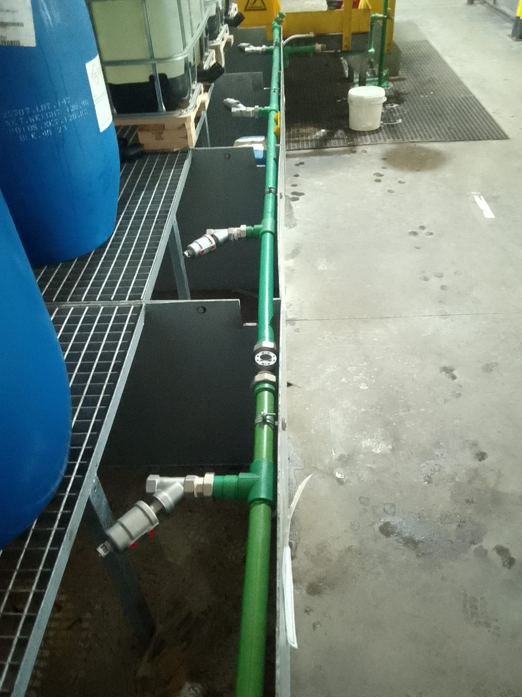

# 🧼 Industrial Fabric Washing System

**An automated industrial solution for efficient and eco-friendly fabric washing processes.**



---

## 📌 Overview
This project is an **industrial-grade fabric washing management system** designed for textile factories, laundries, and manufacturing units. It optimizes washing cycles, reduces water/energy consumption, and ensures quality control through IoT sensors and automation.

### Key Features
- 🚀 **Automated washing cycles** with customizable programs.
- 🌱 **Eco-friendly mode** to reduce water and energy usage.
- 📊 **Real-time monitoring** of temperature, pH, and detergent levels.
- 🔄 **Integration with industrial PLCs** (Siemens, Allen-Bradley).
- 📱 **Dashboard for operators** (web & mobile).

---

## 🛠️ Technical Stack
| Category       | Technologies/Tools |
|---------------|--------------------|
| **Backend**   | Python (Django/Flask), Node.js |
| **Frontend**  | React.js, Bootstrap |
| **Database**  | PostgreSQL, TimescaleDB (for time-series data) |
| **IoT**       | Raspberry Pi, Arduino, Modbus/TCP |
| **Cloud**     | AWS IoT Core, Azure IoT Hub |
| **DevOps**    | Docker, Kubernetes, GitHub Actions |

---

## 🚀 Installation & Setup
### Prerequisites
- Python 3.8+
- Docker (for containerized deployment)
- Industrial PLC simulator (e.g., PLCSIM Advanced for testing)

### Steps
1. Clone the repo:
   ```bash
   git clone https://github.com/yourusername/industrial-fabric-washer.git